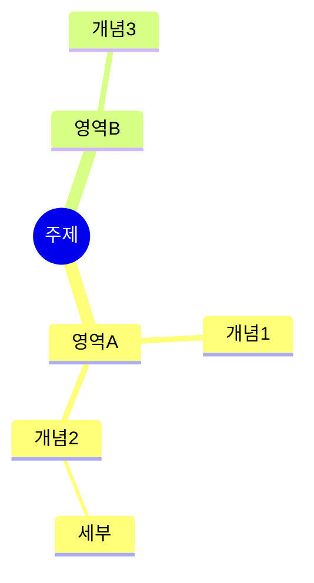

# 마인드맵 프롬프트

노트북 전체 핵심을 mermaid mindmap 문법으로 표현하라.

요구:
- `mindmap` 키워드로 시작
- 루트 `root((중심 주제))`
- 최소 20개 노드, 3단계 이상 분기
- 한국어 라벨
- mermaid 코드 외 다른 텍스트 출력 금지(설명·머리말 모두 금지)
- 출력은 ```mermaid 펜스로 감싼다

예:

